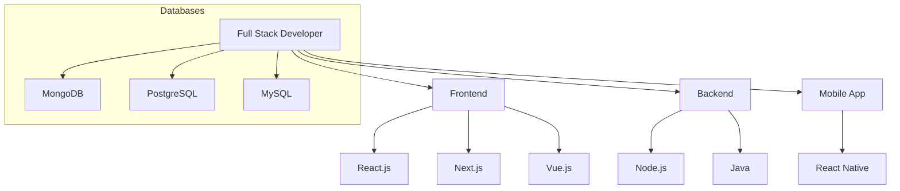

#  **Hey, I'm Abenezer Yoseph!**

I'm a **Full-Stack Developer** passionate about building **web** and **mobile applications**. My focus is on creating intuitive user experiences, backed by scalable and efficient backends.

---

### 🚀 **Tech Stack Overview**

---
### 🛠️ **Languages & Tools**:

```mermaid
graph TD;
    A[Languages & Tools] --> B[JavaScript]
    A --> C[TypeScript]
    A --> D[Python]
    A --> E[Java]
    A --> F[Tailwind CSS]
    A --> G[AWS]
    A --> H[Firebase]
    
    style A fill:#2E3A4D,stroke:#FFFFFF,stroke-width:2px;
    style B fill:#4B6F97,stroke:#FFFFFF,stroke-width:2px;
    style C fill:#4B6F97,stroke:#FFFFFF,stroke-width:2px;
    style D fill:#4B6F97,stroke:#FFFFFF,stroke-width:2px;
    style E fill:#4B6F97,stroke:#FFFFFF,stroke-width:2px;
    style F fill:#4B6F97,stroke:#FFFFFF,stroke-width:2px;
    style G fill:#4B6F97,stroke:#FFFFFF,stroke-width:2px;
    style H fill:#4B6F97,stroke:#FFFFFF,stroke-width:2px;
```

---

### 💻 **What I Do**:  
I specialize in full-stack development, creating engaging UIs and scalable backends. If you're looking for someone to bring your idea to life, let's collaborate and build something amazing together! 

---

### 🌍 **I'm Open for Work!**  
Feel free to explore my repositories and reach out for collaboration! 

---

<!-- Icons -->

