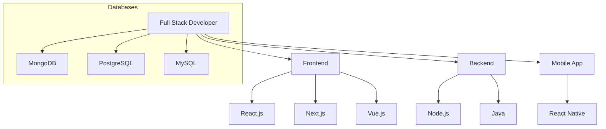

#  **Hey, I'm Abenezer Yoseph!**

I'm a **Full-Stack Developer** passionate about building **web** and **mobile applications**. My focus is on creating intuitive user experiences, backed by scalable and efficient backends.

---

### 🚀 **Tech Stack Overview**



---
### 🛠️ **Languages & Tools**:

```mermaid
graph TD;
    A[Languages & Tools] --> B[JavaScript]
    A --> C[TypeScript]
    A --> D[Python]
    A --> E[Java]
    A --> F[Tailwind CSS]
    A --> G[AWS]
    A --> H[Firebase]
    
    style A fill:#f9f,stroke:#333,stroke-width:2px;
    style B fill:#ccf,stroke:#333,stroke-width:2px;
    style C fill:#ccf,stroke:#333,stroke-width:2px;
    style D fill:#ccf,stroke:#333,stroke-width:2px;
    style E fill:#ccf,stroke:#333,stroke-width:2px;
    style F fill:#ccf,stroke:#333,stroke-width:2px;
    style G fill:#ccf,stroke:#333,stroke-width:2px;
    style H fill:#ccf,stroke:#333,stroke-width:2px;


