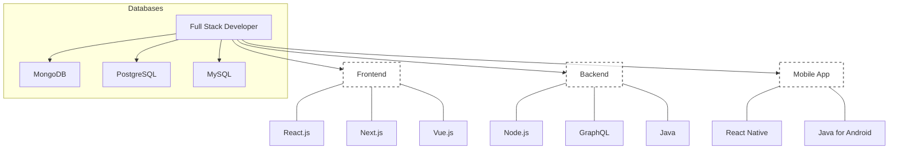

#  **Hey, I'm Abenezer Yoseph!**

I'm a **Full-Stack Developer** passionate about building **web** and **mobile applications**. 
My focus is on creating intuitive user experiences, backed by scalable and efficient backends.

---

### 🚀 **Tech Stack Overview**

---

### 🛠️ **Languages & Tools**:

  
  
  
  
  
  
  
  
  

---

✨ **What I Do**:  
I specialize in full-stack development, creating engaging UIs and scalable backends. If you're looking for someone to bring your idea to life, let's collaborate and build something awesome together!

---

### 🌟 **I'm Open for Work!**  
Feel free to check out my repositories and reach out for collaboration!
