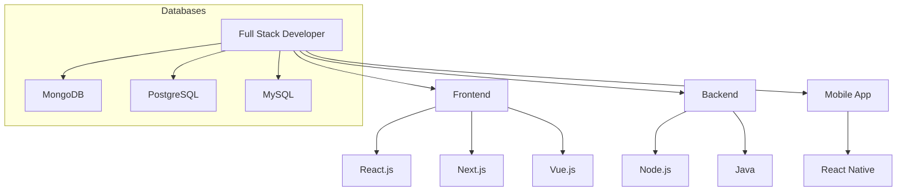

#  **Hey, I'm Abenezer Yoseph!**

I am an **IT Infrastructure Engineer** and **Full-Stack Developer** passionate about building highly available systems and scalable web applications.
### 🔧 What I do:
*   **Infrastructure & SysAdmin:** Managing Windows Server & Linux (Ubuntu, RHEL, CentOS), Active Directory, KVM virtualization, and network troubleshooting (L2/L3).
*   **Full-Stack Development:** Building applications using the MERN stack (MongoDB, Express, React, Node.js) and PostgreSQL.

  
I love solving complex technical problems, whether that means untangling a network issue, optimizing a database query, or deploying a full-stack application on a secure server environment. 🚀
---

### 🚀 **Tech Stack Overview**

```mermaid
graph TD;
    A[Full Stack Developer] --> B[Frontend]
    A --> C[Backend]
    A --> D[Mobile App]
    B --> React[React.js]
    B --> Next[Next.js]
    B --> Vue[Vue.js]
    C --> Node[Node.js]
    C --> Java[Java]
    D --> ReactNative[React Native]
    
    subgraph Databases
        A --> MongoDB[MongoDB]
        A --> PostgreSQL[PostgreSQL]
        A --> MySQL[MySQL]
    end

```

---
### 🛠️ **Languages & Tools**:

```mermaid
graph TD;
    A[Languages & Tools] --> B[JavaScript]
    A --> C[TypeScript]
    A --> D[Python]
    A --> E[Java]
    A --> F[Tailwind CSS]
    A --> G[AWS]
    A --> H[Firebase]
    
    style A fill:#2E3A4D,stroke:#FFFFFF,stroke-width:2px;
    style B fill:#4B6F97,stroke:#FFFFFF,stroke-width:2px;
    style C fill:#4B6F97,stroke:#FFFFFF,stroke-width:2px;
    style D fill:#4B6F97,stroke:#FFFFFF,stroke-width:2px;
    style E fill:#4B6F97,stroke:#FFFFFF,stroke-width:2px;
    style F fill:#4B6F97,stroke:#FFFFFF,stroke-width:2px;
    style G fill:#4B6F97,stroke:#FFFFFF,stroke-width:2px;
    style H fill:#4B6F97,stroke:#FFFFFF,stroke-width:2px;
```
---

### 💻 **What I Do**:  
I specialize in **full-stack development** and **IT infrastructure**, building engaging UIs and backing them up with scalable, highly available server environments. 

Whether you need an idea brought to life or an application deployed securely, let's collaborate and build something amazing together! 💡

---

### 🌍 **I'm Open for Work!**  
Check out my repositories and reach out for collaboration!

---

<!-- Icons 

-->

